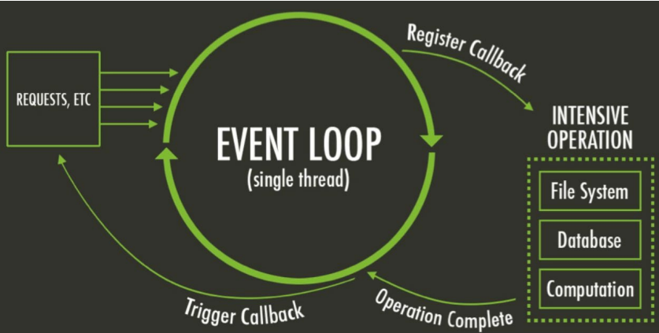

# LECTURE_4
## Node.js is single threaded
- The Node.js server will become unresponsive if requset makes the thread wait for a response
- Therefore: Never wait for a response from i/o operations!

- The asynchronous application model is born

- The Event loop 

## Callbacks
- Callbacks are functions, named or anonymous, sent as arguments to other functions.

- These will be called by the other functions, often when these other functions are complete.

- These will receive arguments with return values or error information.

### A problem with callbacks
- Nested callbacks are hard to read & understand
- Often referred to as ”callback hell” or ”pyramid of doom”

### A solution in two steps
#### Promises were introduced in 2015

- They allow us
    - to chain asynchronous operations naturally
    - to run operations in parallel
    - to handle errors in one place
- Definition: a Promise is an object that represents the eventual completion (or failure) of an asynchronous operation, and its resulting value.

#### The second step: async/await
- But even promises are quite hard to read/understand

- In 2017 the keywords async and await were introduced
    - async acts as a marker for asynchronous functions
        - Will wrap reply in a promise
    - await may be used inside async functions to “wait”
    - await uses promises under the hood
    - any function returning a promise may be awaited

##### Rules for async & await
- In order to await a function call, the call must be made inside a function marked with “async”

- The async marker mostly used for functions with await but could be useful if you want a promise back
