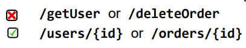
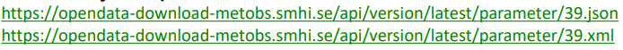

# LECTURE_5

## What is REST?
- Often loosely used to mean any web API using JSON

- REpresentational State Transfer
- What does this mean?
    - Representations: allowing for multiple data representations (formats), like JSON, XML, HTML
    - State Transfer: Using the HTTP protocol/methods to transfer the state of a resource

## Key characteristics
- Statelessness
    - Every request can be understood in isolation
    - Application state (context) kept by client

- Cacheability
- Uniform interface
    - Resources identified in request
    - Usage of HTTP methods (GET, POST, PUT, etc)
    - Response includes possible actions

## REST vs RPC
- Before REST there was SOAP
- SOAP was (is) complex, REST is easy (restful)
- SOAP focuses on procedures (RPC)
- REST focuses on resources (nouns) 

- REST uses HTTP methods
    - GET /users/{id} gets a user
    - DELETE /users/{id} deletes a user

## Resources and naming
- Resources are mapped to URLs
- Resources are nouns in plural form (/users, /orders)
- Hierarchical structure for nested resources
    - All orders for a user: /users/{userId}/orders
    - All courses for a student: /students/{studentId}/courses
    - All friends for a user: /users/{userId}/friends
- Use hyphens if resources use multiple words
    - /customer-orders, not /customerorders

## Naming, cont'd
- Only use lowercase, no spaces or underscore
- Use query parameters for filtering, sorting, and pagination
    - /products?category=electronics&sort=price_asc&page=1
- And searching
    - /books?title=The%20Great%20Gatsby

- Include API version in URL or request header
    - /v1/books

## Working with representations
- The Accept request header may be used to indicate format preference

- Or it may be part of the URL, as in:

- API replies with accepted format in response header:

- Common formats: JSON, XML, Atom, HTML

## HTTP methods
- Methods used by a web browser:
    - GET: fetch a resource (safe, idempotent)
    - POST: create a resource
    - DELETE: delete a resource (idempotent)
    - PATCH: modify a resource

- Idempotency is a property of certain operations or API requests, which guarantees that performing the operation multiple times will yield the same result as if it was executed only once.
- Others: HEAD, OPTIONS

## URL + Method = Action
- URL points to resource
- HTTP method determines action on resource
- Examples
    - GET /orders: fetches all orders
    - DELETE /orders/123: deletes order no 123
    - POST /orders: creates a new order
    - PUT /orders/125: replaces order no 125
    - PATCH /orders/125: modfifes order no 125
    - POST, PUT, PATCH need a body

## HTTP status codes
- A REST API uses HTTP status codes to communicate the effect of a request.
-  Five families:
    - 1xx: Informational (rarely used)
    - 2xx: Successful
    - 3xx: Redirection
    - 4xx: Client error
    - 5xx: Server error

## Most used status codes
- 200: OK

- 201: Created – Used as a response to POST
- 202: Accepted – Message received but not processed
- 301: Moved permanently
- 400: Bad request
- 401: Unauthorized
- 404: Not found
- 405: Method not allowed
- 500: Server error

## HATEOAS
- Most REST APIs follow principles mentioned above
- But HATEOAS is mostly ignored or forgotten
- HATEOAS means Hypermedia As The Engine Of Application State
- It’s about adding links to a response, just like an HTML page contains links to other pages
- These links define what can be done with the current resource

## Adding hypermedia links
- A response could look like this:

- It tells the client that this book
    - has reviews
    - can be updated
    - can be deleted
- Not all books have reviews
- Not all users can update and delete
- Client uses links to provide options

## Why/why not add links?
- Why?
    - Client needs to know less, just obeys API response
    - Easier to change API

- Why not?
    - Larger payloads
    - More work to create response
    - Client still need to know possible links

## Adding hypermedia links
- There's no standard of the hypermedia link format
    - Hypertext Application Language (HAL)?

- Questions:
    - Should links contain base address or just path?
        - Probably base address
    - Should links be added for each item in a collection?
        - As a default yes, but could be turned of
    - Which actions should be added?
        - Probably all meaningful actions for the current user