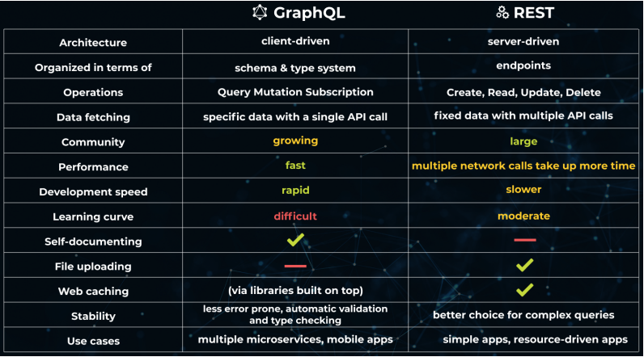

# LECTURE_6

## What is GraphQL
- Created by Facebook, open-sourced in 2015

- "Get exactly what you need in a single query"

- Also: possible to "mutate" and "subscribe"

- GraphQL is a query language for APIs and a runtime for fulfilling those queries with your existing data. GraphQL provides a complete and understandable description of the data in your API, gives clients the power to ask for exactly what they need and nothing more, makes it easier to evolve APIs over time, and enables powerful developer tools.

## GraphQL vs REST
- Overfetching:
    - Overfetching refers to a pattern commonly associated with REST, in which unnecessary and unused data is sent over the network in response to an API request.

- Underfetching
    - underfetching is a pattern associated with REST, in which insufficient data is returned by the request

- But Rest has these advantages:
    - easier to implement
    - can be used from web browser directly (GET)
    - easier to cache responses
    - maps better to the HTTP protocol
        - uses all HTTP methods
            - GraphQL only uses POST
        - uses HTTP response codes
            - GraphQL only uses 200 OK
    - GraphQL's flexibility is also a vulnerability

## Type definitions (schema)
- An example:
    - `type Movie {
        movieId: ID!
        title: String
        actors: [Actor]
        }`

    - ` type Actor {
        actorId: ID!
        name: String
        movies: [Movie]
        }`
- Two types (Actor, Movie)
- Fields
- Field types: ID, String, Int, Float, Boolean
- Non-nullable fields (!)
- Lists using []
- Nested structures

- The GraphQL schema language supports the Scalar types of String, Int, Float, Boolean, and ID. By default, every type is nullable - it's legitimate to return null as any of the scalar types. Use an exclamation point to indicate a type cannot be nullable, so String! is a non-nullable string. To use a list type, surround the type in square brackets, so [Int] is a list of integers.

## Defining queries
- Type definitions are not enough (vs a database)

- Queries must also be defined
- Act as API endpoints
- Uses the built-in type Query:
`
type Query {
allActors: [Actor]
allMovies: [Movie]
movieSearch(searchString: String!): [Movie]
moviesByTitle(title: String!): [Movie]
}
`
- The Field Query type become the entry points for queries into the GraphQL service. GraphQL schemas may also contain a Mutation type, which defines the entry points for write operations into the API. A third special entry-point-related type is the Subscription type, which defines events to which a client can subscribe.

## Mutations
- It's also possible to create operations for adding, deleting and updating data

- These operations are called "mutations"

## Subscriptions
- GraphQL also supports real-time updates from the server
- Using this subscription, the client will receive new movies as they are added to the server

## Introspection
- GraphQL allows a client to query the schema
- There already are powerful GraphQL clients with introspection features:
    - Apollo Studio
    - GraphiQL
- They allow us to explore the schema and run the defined queries, mutations and subscriptions

- Introspection is a powerful feature of GraphQL that allows us to ask a GraphQL API for the types and queries it supports. Introspection becomes a way of self-documenting the API

## Resolvers
- Resolver functions fetch data for every field, field by field
- Translates query to storage operations
- Each function receives four arguments (in this order):
    - parent: the parent object
    - arguments: like "searchString", "title"
    - context: used for db connections, authentication
    - info: more advanced, used for optimization
- Default resolvers often used for leaf properties
    - for example, name: (actor) => actor.name

    - allActors: () => actors , A no argument function, returning all actors

    - moviesByTitle: (_, { title }) => movies.filter(m => m.title === title) , Uses ”title” argument to return only those movies with specified title

    - movies: (actor) => movies.filter(m => actor.movies.includes(m movieId)), Uses parent actor to return the movies existing among actor movies

## The N+1 problem
- You have 1 main query
- Followed by N queries for related data
- Not only a problem for GraphQL
- Solutions:
    - Eager loading using JOINS (fetch everything at once)
    - Lazy loading (avoid fetching until needed)
    - Caching
    - In GraphQL: DataLoader

## Using the DataLoader
- The DataLoader batches individual calls into one

- Will call a db function at the end of the request
- Could be used to cache database responses within one request
- The loaders should be created anew for each request
- They should be supplied using the context parameter

## Postgraphile
- You could do all this work, OR...
- You could install Postgraphile
- It will create a GraphQL API based on a PostgreSQL schema